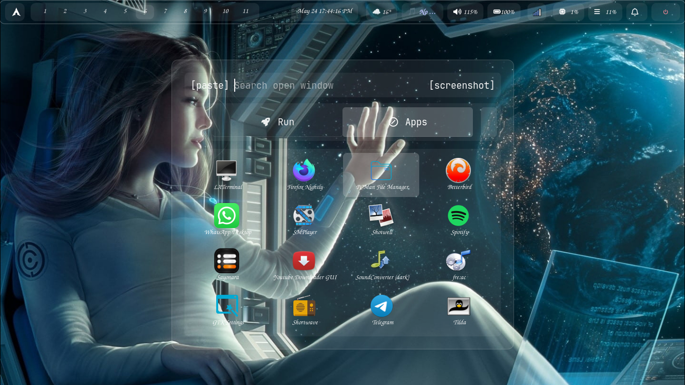
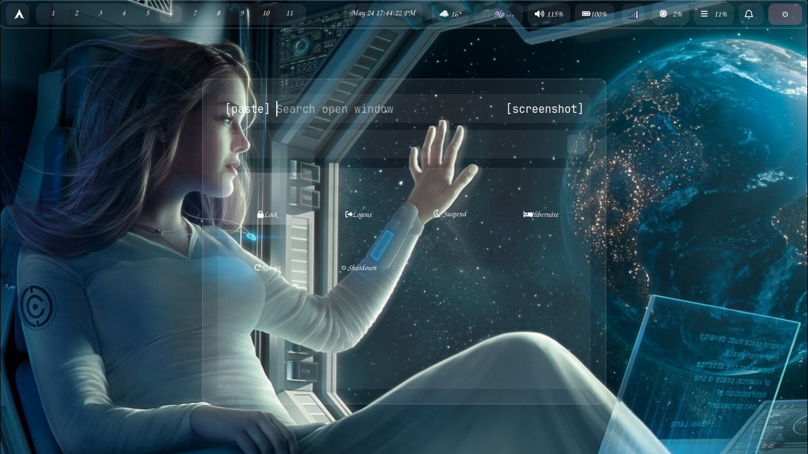
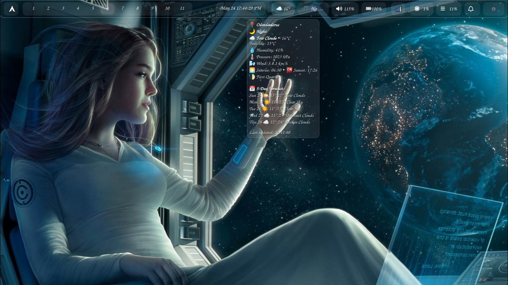
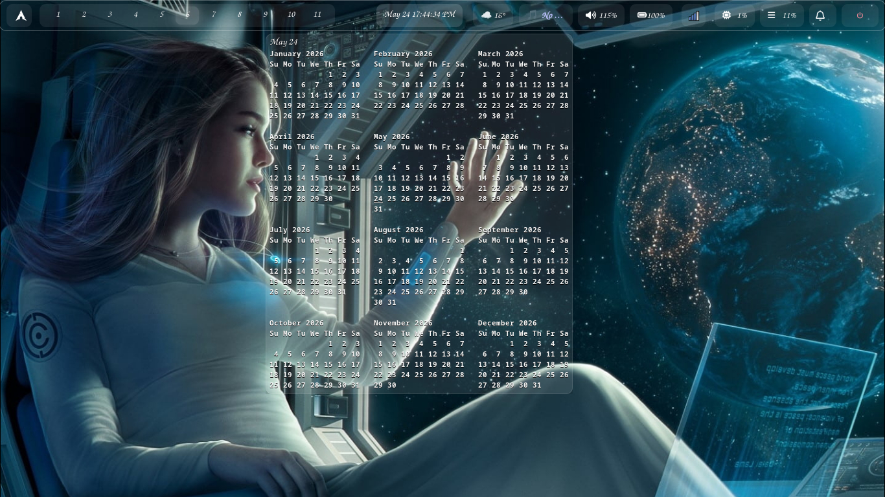

# dwl Dotfiles & Source

  

*A heavily customized, plug-and-play dynamic tiling Wayland compositor (dwm for Wayland).*

---

## ✨ Highlights
- **Custom Protocols:** Includes `wlr-layer-shell-unstable-v1` and `dwl-ipc-unstable-v2` for enhanced bar and widget support.
- **Sleek Aesthetic:** Integrated with a transparent, grey-themed Waybar and Rofi launcher.
- **Plug & Play:** Designed to be installed system-wide via a custom PKGBUILD, ensuring all binaries and configs are in their correct standard locations.
- **Dual Theming:** Switch between Catppuccin Macchiato (dark) and Latte (light) Waybar themes.

## 📖 Documentation & Installation

For full instructions on how to patch and build dwl, configure Waybar, and use the keybinds, please visit the **[Official Documentation Website](https://wgparch.codeberg.page/dwl/)**.

## 📸 Screenshots

