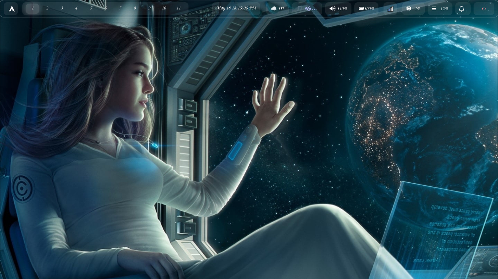

# dwl Dotfiles & Source



<div align="center">


*A heavily customized, plug-and-play dynamic tiling Wayland compositor (dwm for Wayland).*

</div>

## ✨ Features
- **Custom Protocols:** Includes `wlr-layer-shell-unstable-v1` and `dwl-ipc-unstable-v2` for enhanced bar and widget support.
- **Sleek Aesthetic:** Integrated with a transparent, grey-themed Waybar and Rofi launcher.
- **Plug & Play:** Designed to be installed system-wide via a custom PKGBUILD, ensuring all binaries and configs are in their correct standard locations.
- **Scripts:** Includes custom power menus, screenshot tools, and theme files.

## 📂 Structure

.config/dwl/
├── dwl/              
│   ├── config.h         
│   ├── protocols/      
│   └── ...          
├── configs/         
│   └── waybar/         
└── scripts/             

 ⚙️ Installation (Plug & Play)

This repository is designed to be installed as a system package using `makepkg`. This ensures `dwl` is available in your PATH and integrates cleanly with your display manager.

### 1. Prerequisites
Ensure you have the base development tools and dependencies installed. Choose the `wlroots` version that matches your system:

**For most users (wlroots 0.19):**
```bash
sudo pacman -S base-devel wayland-protocols xorg-xwayland libinput
trizen -S wlroots0.19 wlroots-git

git clone https://codeberg.org/WgpArch/dwl.git ~/.config/dwl
cd ~/.config/dwl
makepkg -si

# If installing manually from source:
cd dwl
make clean
make
sudo make install

Waybar: Symlink the provided Waybar configs:

ln -sf ~/.config/dwl-repo/configs/waybar ~/.config/waybar

Scripts: Ensure scripts in ~/scripts are executable:

chmod +x ~/.config/dwl-repo/scripts/*

Theming

Font: Z003 (gsfonts installed from any AUR helper of choice)
Colors: Catppuccin Macchiato / Latte (see configs/waybar/)

Credits

dwl: dwl community
Protocols: wlroots, wayland-protocols
Icons: Font Awesome


## 📸 Screenshot

## 📸 Screenshots
